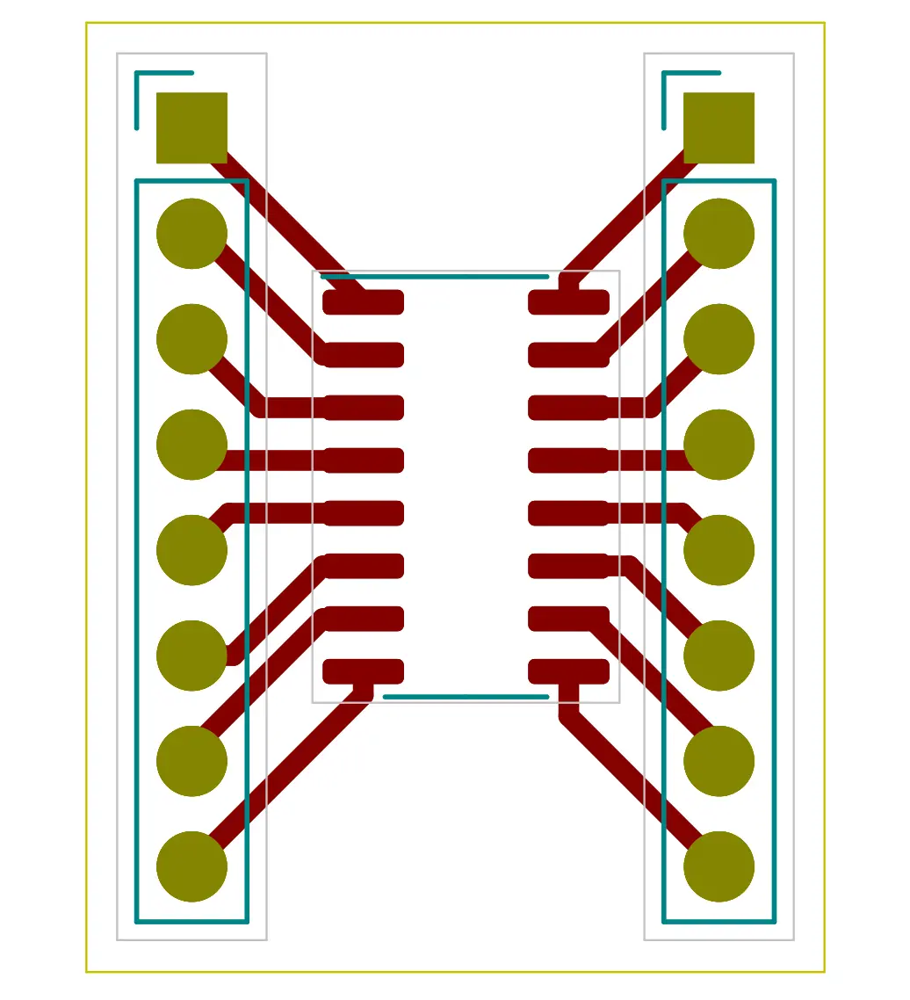
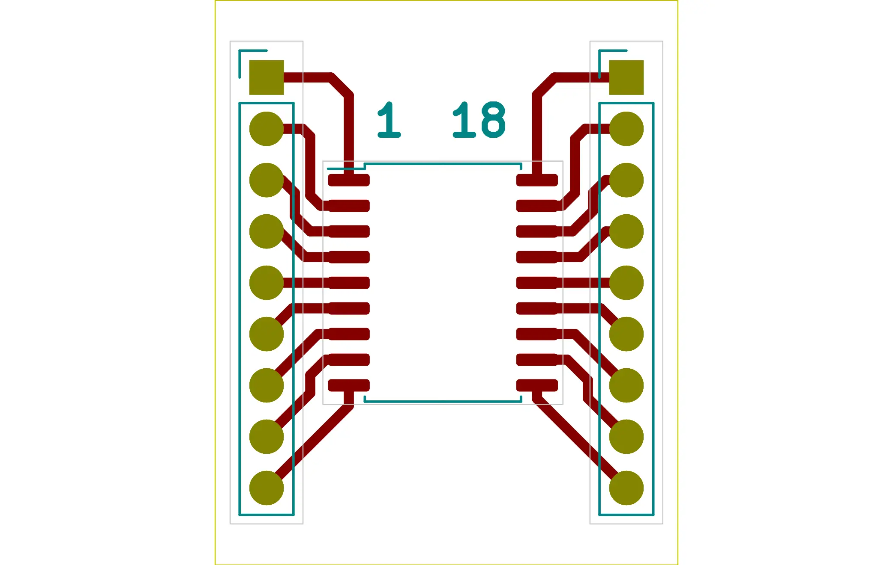
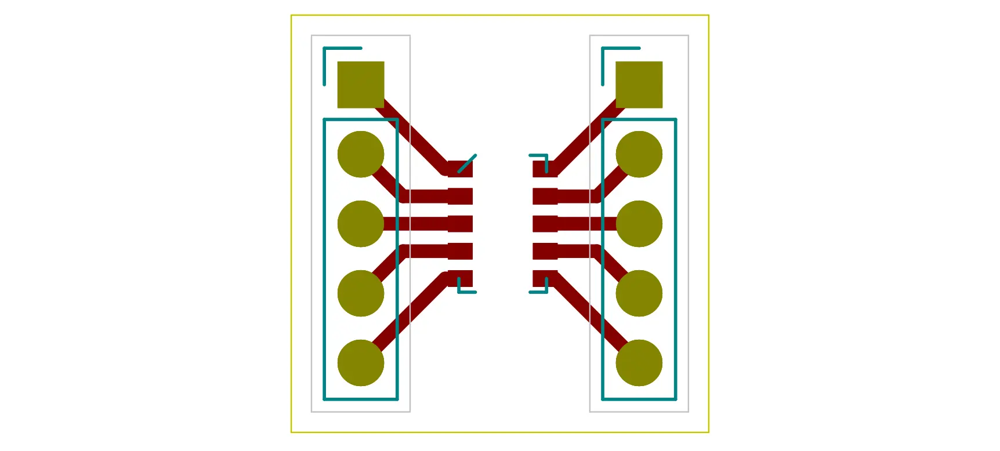
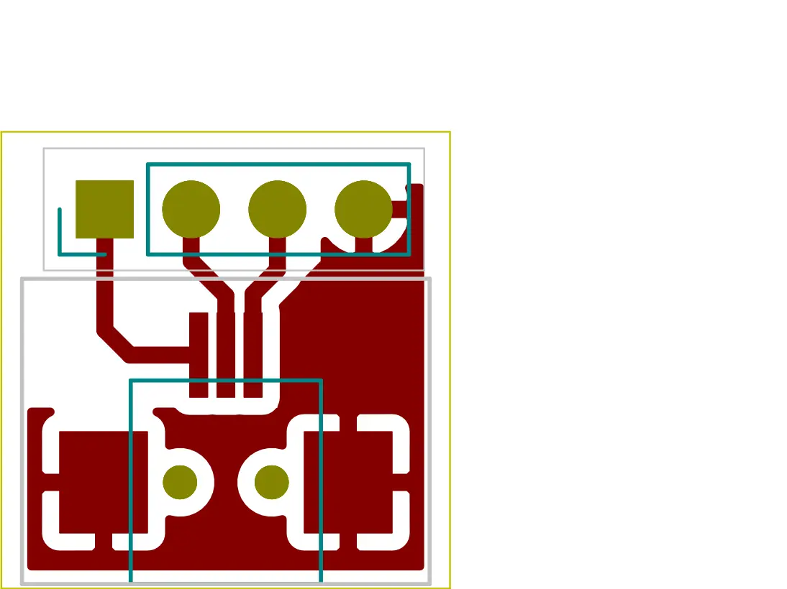

# Generic Adapters for SMD to THT
All SMD adapters are for 2.54mm header

## SOIC-16 -- small version

## SOIC-18 -- wide version

## SC-70-6

## SON10
Mostly used by european companies as the step is 1mm (I guess).

# Plugs
## MQ172 3-pin

No warranty for anything in this repo.
